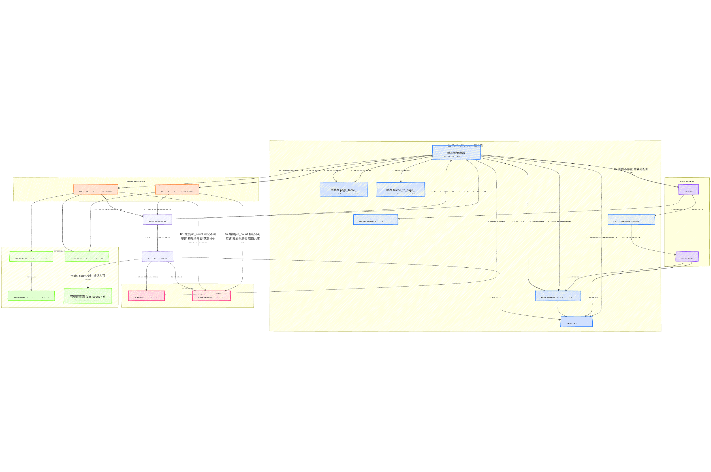
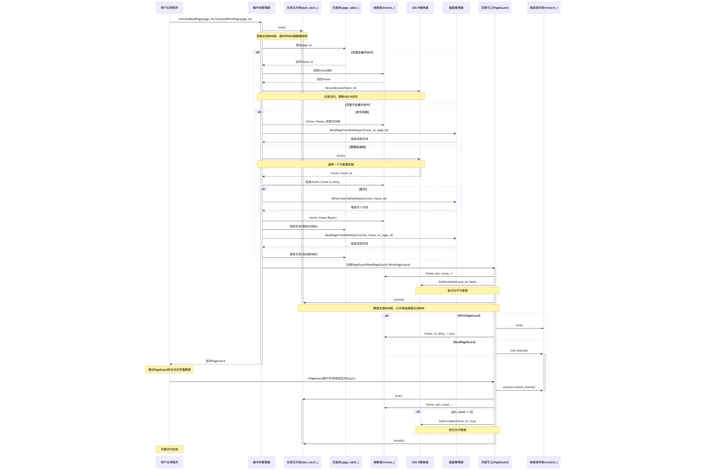

## 前言

本文希望将bufferpool的所需组件和实现思路讲清楚。并发控制可能不会提及太多。如果有错误理解欢迎大家指出。

bufferpool总体分为几个部分：LRU-K-Replacer，DiskScheduler，PageGuard。BufferPoolManager就是将这些部件组合起来，将缓存池行为具体实现。

>其中LRU-K组件需要保证自身的并发可用，BufferPoolManager不应该需要处理Replacer的并发控制。（不知道为什么我会在这里提到，但是就是突然想起来了）

### 大纲

我们尽量一步一步的解读我的实现思路。按照官网的Project Task顺序，再在每一个Task中由思路探寻到具体实现。所以我在开篇大概拟定一下本文大纲。

首先是关于Task1，Replacer的设计与实现以及优化思路。

其次是Task2，DiskScheduler，Task2很简单，一下就做完了，这里主要介绍一下`std::promise`，回调函数之类的知识点

最后是重头戏Task3，BufferPoolManager，需要首先从缓存池管理器的原理开始介绍，再到缓存池和缓存池管理器都是针对什么层次进行操作/管控，再下降到系统架构设计，展示各组件之间的关系，比如：

- BufferPoolManager：总体管理器

- FrameHeader：帧管理

- PageGuard：安全访问机制

- LRUKReplacer：替换策略

- DiskScheduler：磁盘I/O调度

在介绍这些的时候，顺便介绍一下内部的数据结构和api等，比如

- 内存管理：frames_数组如何存储和管理内存帧

- 映射表：page_table_和frame_to_page_如何实现双向查找

- 状态跟踪：pin_count_、is_dirty_的作用

- 并发控制：各类锁(bpm_latch_、frame->rwlatch_)的作用


介绍完大的组件之后，再介绍实现逻辑行为的具体函数，最后再写一下并发控制机制。

我的实现中的总体架构图





## Task1 LRU-K-Replacer

以下内容部分摘自[auzdora的博客](https://auzdora.github.io/2023/03/26/LRU-K_Replacement_Policy/)

### Replacement Policy

缓存驱逐算法的应用场景是，由于内存和硬盘之间读写速度的巨大差异，并且有程序局部性原理的存在，我们想通过**保存从硬盘中读取出的东西在内存中**，这样一种方法来尽可能减少两者之间速度的差异，提高CPU的利用率和处理速度，减少不必要的等待时间。从硬盘中读取出的数据一定是换存在内存中的，而由于内存的大小局限性，我们不可能无限的存储硬盘的page，甚至只能分配内存的一小部分作为缓存空间来使用。

这样的缓存空间一定是有大小的，有大小就会涉及到缓存存满的问题。如果想要再存放新读入的数据到缓存空间中，必须选择一个内存块将其驱逐出去。把空间给腾出来。选择哪一块驱逐，就是替换算法（replacement policy）所做的事情。一般常见的替换策略有FIFO，LRU以及LFU等等。

下图展现了硬盘数据和内存之间提取（Fetch）和驱逐（Evict）的关系。


上面图片中，Buffer Pool就是缓存数据的池子，最大容量为3个page。Disk上面的Data数不胜数，当需要数据时系统会从Buffer Pool检索，如果检索到了，则直接从内存中提出数据，并且通知**LRU-K Replacement Policy**组件调用了这个page。如果没检索到，就从硬盘中读取一块。如果此时Buffer Pool满了，那就询问**LRU-K Replacement Policy**组件，索要一个可以驱逐的frame id号，系统再根据这个frame id从内存中把对应的page重新写回硬盘（**NOTE：LRU-K不做任何实际的数据操作，仅仅是记录frame的状态，并根据一定的策略将可以驱逐的frame id号提供给系统**）。

传统的LRU算法我们都很熟悉，大家都知道这种算法有一个缺点，有些时候只读取一次且不太可能再次使用的页面会污染缓存池，这可能会导致缓存池驱逐出真正的有价值的被频繁访问的热页面。所以光靠时间这一指标作为驱逐标准显然是没那么合适的。所以改进的LRU-K算法出现了。

**LRU-K**是一种改进的替换策略，它不仅考虑页面最后访问时间，还考虑访问历史和频率。

### LRU-K的排序策略

LRU-K算法的核心在于如何确定页面的驱逐优先级：

访问次数少于k次的页面：

- 优先驱逐访问次数少于k次的页面

- 当多个页面都少于k次访问时，按最早访问时间排序（类似传统LRU）

访问次数达到k次的页面：

- 按照最早的访问时间排序

- 这相当于比较k-距离（当前时间与第k次最早访问的时间差）

### LRU-K中的类与数据结构

#### AccessType 枚举类型

可用于根据不同访问进行Record优化
优化思路如下
https://blog.csdn.net/weixin_70354558/article/details/130663075

- get 根据分布会更加偏向于选择特定页
- scan 顺序处理页

scan 模拟的就是全局性的操作，本质是对 LRU-K 进行污染。所以可以做一个简单的优化，就是scan的时候不记录，只有get的时候记录。实测qps能提升200左右。

#### LRUKNode 类

##### 目的

代表缓冲池中的一个帧(frame)，记录访问历史和状态

##### 关键成员

- `history_` (std:\:list<size_t>)：存储最近 K 次访问的时间戳
    - 链表**头部**存储**最新**时间戳，尾部是最早时间戳
- `k_` (size_t)：LRU-K 算法中的 K 值
- `fid_` (frame_id_t)：该节点对应的帧 ID
- `is_evictable_` (bool)：标记该帧当前是否可以被驱逐

##### 关键方法

- `MyPush(size_t time)`：向 history_ 添加新的访问时间戳
    - 如果 history_ 大小达到 k_，先移除最早时间戳，再插入新时间戳
- `GetEarliestTimestamp()`：返回 history_ 中的最早时间戳
- `GetAccessCount()`：返回 history_ 的大小，即当前记录的访问次数
- `operator<(const LRUKNode& other)`：**LRU-K 驱逐逻辑的核心**
    - 如果两个节点的访问次数都 < k_，比较最早访问时间戳，时间戳小的优先驱逐
    - 如果一个节点访问次数 < k_ 而另一个 >= k_，访问次数少的优先驱逐
    - 如果两个节点访问次数都 >= k_，比较第 K 次访问时间戳，时间戳小的优先驱逐
#### LRUKReplacer 类

##### 目的
管理所有可驱逐的帧，根据 LRU-K 策略选择牺牲者

##### 关键成员

- `evictable_nodes_` (std:\:set\<LRUKNode>)：有序集合，存储所有当前 **可驱逐** 的 LRUKNode
    - std::set 根据 LRUKNode 重载的 operator < 自动排序
    - set 的 **起始位置**总是存放着**最应该被驱逐**的节点
- `node_store_` (std:\:unordered_map<frame_id_t, LRUKNode>)：哈希表
    - 存储缓冲池中**所有**帧 ID 到对应 LRUKNode 的映射
- `current_timestamp_` (size_t)：全局单调递增的时间戳
- `k_` (size_t)：LRU-K 的 K 值
- `latch_` (std:\:mutex)：互斥锁，保护线程安全
- `curr_size_` (size_t)：当前 evictable_nodes_ 中的节点数量
- `replacer_size_` (size_t)：Replacer 设计容量

##### 关键方法

- `RecordAccess(frame_id_t frame_id, ...)`：记录帧被访问
    
    1. 获取全局时间戳 current_timestamp_++
    2. 查找或创建对应的 LRUKNode
    3. 调用 LRUKNode 的 MyPush() 方法更新访问历史
    4. 如节点在 evictable_nodes_ 中，需先移除再重新插入

- `SetEvictable(frame_id_t frame_id, bool set_evictable)`：设置帧是否可驱逐
    
    1. 找到对应的 LRUKNode
    2. 如设为可驱逐：更新状态并插入 evictable_nodes_
    3. 如设为不可驱逐：更新状态并从 evictable_nodes_ 移除

- `Evict()`：驱逐一个页面
    
    1. 检查 evictable_nodes_ 是否为空
    2. 取 evictable_nodes_.begin() 作为牺牲者
    3. 获取牺牲者节点的 frame_id
    4. 调用 Remove() 移除该节点
    5. 返回牺牲者的 frame_id

- `Remove(frame_id_t frame_id)`：完全移除一个帧
    
    1. 查找节点，如找不到直接返回
    2. 如节点可驱逐，从 evictable_nodes_ 中移除
    3. 从 node_store_ 中移除该节点

- `Size()`：返回当前可驱逐帧的数量

#### 一个关于Set和const的注意事项

请看如下代码
```c++
/**
   * 注意：当遍历std::set容器时，迭代器提供的元素引用总是const的，
   * 即使没有使用const auto&声明。这是因为std::set的设计要求元素不可修改，
   * 以维护其内部排序。因此，只能在这些对象上调用const成员函数，
   * 例如FidGetter()必须声明为const才能被调用。
   *
   * 如果需要修改std::set中的元素，正确的做法是：
   * 1. 从set中移除该元素
   * 2. 创建并修改该元素的副本
   * 3. 将修改后的新元素插入set
   */
  for (const auto &node : evictable_nodes_) {
    frame_id_t evict_id = node.FidGetter();
    auto node_it = node_store_.find(evict_id);
    if (node_it != node_store_.end() && node_it->second.EvictableGetter()) {
      // 从evictable_nodes_和node_store_中移除节点
      evictable_nodes_.erase(node);
      node_store_.erase(evict_id);
      curr_size_--;
      return evict_id;
    }
  }
```

#### 与 BufferPoolManager 的交互

- BufferPoolManager 持有一个 LRUKReplacer 的实例 (replacer_)。

- 当 BufferPoolManager 中的页面被访问（如 FetchPage）时，它会调用 replacer_->RecordAccess()。

- 当页面的 pin_count_ 降为 0 时，BufferPoolManager 调用 replacer_->SetEvictable(frame_id, true)。

- 当页面的 pin_count_ 从 0 变为 >0 时，BufferPoolManager 调用 replacer_->SetEvictable(frame_id, false)。

- 当 BufferPoolManager 需要空间来加载新页面，并且没有空闲帧时，它会调用 replacer_->Evict() 来获取一个牺牲帧的 ID。

- 当 BufferPoolManager 删除一个页面时，如果该页面在缓冲池中，它需要调用 replacer_->Remove() 来停止追踪对应的帧。

#### LRUK的并发安全

直接用一把scope锁在每个函数前锁一下就行了。下面是一个实例

```c++
void LRUKReplacer::RecordAccess(frame_id_t frame_id, AccessType access_type) {
std::scoped_lock<std::mutex> lock(latch_);
...
```

## Task2 DiskSchduler

Disk_scheduler 的主要职责是安排和执行数据库页面的读取和写入操作。它是一个异步调度系统，通过后台工作线程处理 I/O 请求，避免主线程被磁盘操作阻塞。

### 工作原理

DiskScheduler 通过一个名为 `Schedule` 的方法接收磁盘请求，这些请求被放入一个共享队列中： disk_scheduler.h:57

每个请求包含以下信息：

- 是读操作还是写操作（`is_write_`）
- 数据指针（`data_`）
- 页面ID（`page_id_`）
- 回调对象（`callback_`）用于通知请求完成 disk_scheduler.h:27-42

DiskScheduler 维护一个后台工作线程，负责从队列中取出请求并通过 DiskManager 执行实际的磁盘操作： disk_scheduler.h:84-87

### 在系统架构中的位置

DiskScheduler 是由 BufferPoolManager 创建和管理的： buffer_pool_manager.cpp:73-75

它与 PageGuard 类共享，以便于执行页面刷新操作： page_guard.cpp:31-38

### 优势

1. **异步操作**：通过后台线程处理 I/O 请求，主线程可以继续执行其他操作，不会被磁盘 I/O 阻塞
2. **并发控制**：使用 Channel 队列安全地在多线程环境中调度请求
3. **回调机制**：使用 promise/future 机制通知请求完成，实现非阻塞的请求-响应模式
4. **资源管理**：支持页面删除和资源释放

## Task3 BufferPoolManager

处于查询执行引擎（Execution Engine）之下，磁盘存储管理器（Disk Manager）之上，属于储存层的组件。管理整个数据库的所有页面缓存。

以下是[DeepWiki](https://deepwiki.com/cmu-db/bustub/4-storage-layer)上的层次图


借用隔壁miniob的图来更直观的说明BufferPool的层次


在整个Bustub DB中只有一BuffPollManager这个单一的BufferPoolManager实例管理整个数据库的所有页面缓存实例。

主要职责：

- 管理内存缓冲池中的数据页（page）与磁盘数据之间的交换

- 实现页面缓存机制，减少磁盘I/O操作

- 通过页面替换策略（如LRU-K）决定哪些页面应当被驱逐

- 处理页面的读取、写入、创建和删除请求

与其他模块关系：

- 上层模块（如执行引擎）通过Page Guard接口向缓冲池请求页面

- 下层与磁盘管理器交互，负责实际的页面读写

- 与日志管理器协作以支持事务的持久性和恢复

### FrameHeader

BufferPoolManager通过FrameHeader辅助类对页面进行数据上的操作（不知道这样说准不准确，但实际上是BufferPoolManager获取指定Frame的PageGuard之后，调用Guard的数据操作方法，但Guard的数据方法实际上返回的就是FrameHeader里面的函数，所以可以本质上，还是通过Frame Header类进行数据操作，我们会在后面看到这部分的代码）。FrameHeader就是Frame的具体数据结构，可以理解为缓存池中的空位，可以将页面缓存进来的空位，在系统的整个生命周期内，所有 `FrameHeader` 都会存储许多不同的页面。

FrameHeader 有一个名为 `GetData` 的方法，该方法返回指向其帧内存的原始指针， `DiskScheduler` / `DiskManager` 将使用此指针将磁盘上物理页面 `FrameHeader` 内容复制到内存中。其中GetDataMut返回一个可以修改的指针，WritePageGuard可以利用GetDataMut对页面内容进行修改。

```c++
// FrameHeader是Frame在内存中具体的数据结构
class FrameHeader {
  friend class BufferPoolManager;
  friend class ReadPageGuard;
  friend class WritePageGuard;

 public:
  explicit FrameHeader(frame_id_t frame_id);

 private:
  auto GetData() const -> const char *;
  auto GetDataMut() -> char *;
  void Reset();

  /** @brief The frame ID / index of the frame this header represents. */
  const frame_id_t frame_id_;

  /** @brief The readers / writer latch for this frame. */
  std::shared_mutex rwlatch_;

  /** @brief The number of pins on this frame keeping the page in memory. */
  std::atomic<size_t> pin_count_;

  /** @brief The dirty flag. */
  bool is_dirty_;

  /**
   * @brief A pointer to the data of the page that this frame holds.
   *
   * If the frame does not hold any page data, the frame contains all null bytes.
   */
  std::vector<char> data_;

};
```

### PageGuard

BufferPoolManager所有对页面进行的操作，都要在PageGuard获取之后进行，以下是一个实例代码

```c++
  auto disk_manager = std::make_shared<DiskManager>(db_fname);
	auto bpm = std::make_shared<BufferPoolManager>(FRAMES, disk_manager.get(), K_DIST);

  page_id_t pid = bpm->NewPage();

  char str[] = "Hello, world!";

  // Check `WritePageGuard` basic functionality.
  {
	  // 在WritePage函数中会尝试获取PageGuard，用于获取对页面的写入(独占)访问权限
    auto guard = bpm->WritePage(pid);
    char *data = guard.GetDataMut();
    snprintf(data, sizeof(str), "%s", str);
    EXPECT_STREQ(data, str);
  }
```


PageGuard为Frame的访问提供了并发保护。其分为以下两种类型

ReadPageGuard：

- 提供线程安全的页面读取访问

- 允许多个线程同时读取同一个页面

- 确保在读取期间没有线程可以修改页面数据

WritePageGuard：

- 提供线程安全的页面写入访问

- 同一时间只允许一个线程写入页面

- 确保在写入期间没有其他线程可以读取或写入该页面


以下是RAII类里面的函数，其中析构函数的逻辑是放在Drop里面的


这两个类都是RAII类，RAII（资源获取即初始化）是C++中一种资源管理模式

#### RAII建立在两个C++语言特性上：

1. 构造函数：对象创建时自动调用，用于获取资源

2. 析构函数：对象销毁时自动调用，用于释放资源

核心思想：将资源的生命周期与对象的生命周期绑定

#### RAII的关键优势

自动资源管理：

- 无需记住手动释放资源

- 避免了"忘记释放"导致的资源泄漏

异常安全：

- 即使发生异常，资源也会被正确释放

- 不需要编写容易出错的try-catch块

### 关于锁的管理

参考大佬Refrain的[知乎文章](https://zhuanlan.zhihu.com/p/828933572)，写的很透彻。

**_1、pin_count_和rw锁的交互_**

这一点在LEC6的阅读材料Chapter 13.2-13.5中有，我没记错的话应该是13.4小节，书上给出了正确的做法：**遵循pin->lock->unlock->unpin的顺序**，我分两个部分来讨论为什么要这么做，第一个是pin和lock的顺序，第二个是unlock和unpin的顺序。

这里仅讨论互斥的锁.

如果选择的是**lock->pin**:


如上图所示, 假设P1进程取得锁,然后pin (_pin_cnt_=1) 住某个page, 过程中另外一个P2进程想要访问该page, 那么P2会等待锁...某一个时刻, P1进程unpin (_pin_cnt_=0) 然后放掉了锁, 问题出在这里: **P2在获取锁并在缓存池中pin住改page之前, 该page可能会被驱逐刷回磁盘**. 这样便导致了P2看到的数据不一致 ( 设想一下, P2访问该page的过程一定是通过缓存命中然后等待锁 ).

如果选择**unpin**->**unlock**:

那么现在的pin&lock策略是: **pin->lock->unpin->unlock**, 问题和上面类似, unpin->unlock期间的空档, 该page有被驱逐出缓存池的风险.

**故pin&lock的策略是** **pin->lock->unlock->unpin**.

**_2、bpm锁保护pin_count_和SetEvictable()_**

当我们修改_pin_count__的时候，可能伴随着调用_SetEvictable()_来修改frame的状态，_pin_count__是原子变量，原子修改没问题，_SetEvictable()_是下层_LRUKReplacer_提供的接口，它向我们(bpm层)保证了原子性，也没有问题，但是在我们bpm层，需要保证这两个操作之间不会被插队，所以在PageGuard中需要bpm锁将其锁在一起。

如果不使用bpm锁保护的话：

根据前面讨论过的unlock和unpin的顺序，在_unpin_->_SetEvictable()_发生的时候已经释放掉了读写锁了，因此这里允许被其他线程插队。一个很简单的例子就能证明这里的错误。就是在我们_Drop()_一个page的时候，我们让其_pin_count__减小为0----此时发生插队----其他线程的视角下，这是一个留在_BufferPool_中，_pin_count__为0但又不可驱逐的page，这和_LRUKReplacer_的**Invariant**冲突，可以就此断定冲突了(虽然目前没什么实质性上的，比如数据读取错误之类的冲突，但是我们可以继续往下思考，构造出无数的反例，所以不再继续讨论，快进到后面的内容)。

**_3、获取page读写锁之前释放bpm锁_**

或者您可以理解为构造PageGuard实例之前不允许持有bpm锁， 这要求并不隐晦，如果您阅读过**DeadlockTest**考虑的case。

不过我需要说服自己的是：**释放bpm锁->获取page rwlock这段时间，如果被其他线程插队怎么办？**

释放bpm锁之前，我们已经做了的无非就是更新BufferPoolManager维护的一些数据，做一下pin和_SetEvictable()_的工作，而获取page读写锁之后，我们将对page数据进行具体地读写操作。我们讨论的插队现象发生的场景是在**更新完BufferPoolManager维护的数据+pin+_SetEvictable()_之后----拿到page读写锁，构造_PageGuard_实例，将该page的资源句柄返回给请求者之前**。

插队的线程无非就两种类型，要么其他线程写它，要么其他线程读它。由于pin发生在lock之前，所以能保证插队发生前后，该frame不会被驱逐，那这就保证了被插队的线程，重新执行的时候能从BufferPool中用到正确的数据，那么读线程的插队就是安全的；

其次就是写线程的插队，这个我们需要结合到上层调用者来看，我们通常调用接口_CheckedWritePage_构造PageGuard以此获取page的资源句柄，然后紧跟着才是对其进行读写，而这里的插队发生在获取该资源句柄过程中中，也就是还没返回到调用者，那么我们把**中间插入的操作视为更早的操作**即可。

