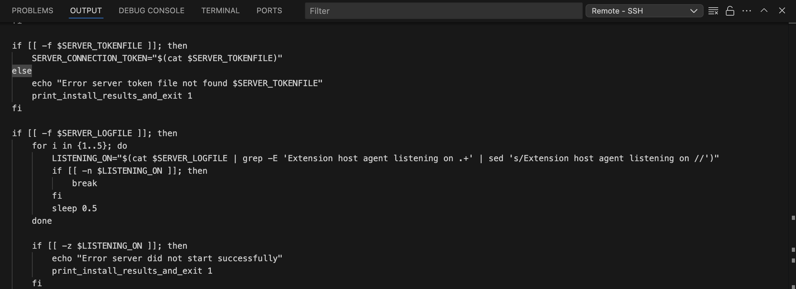
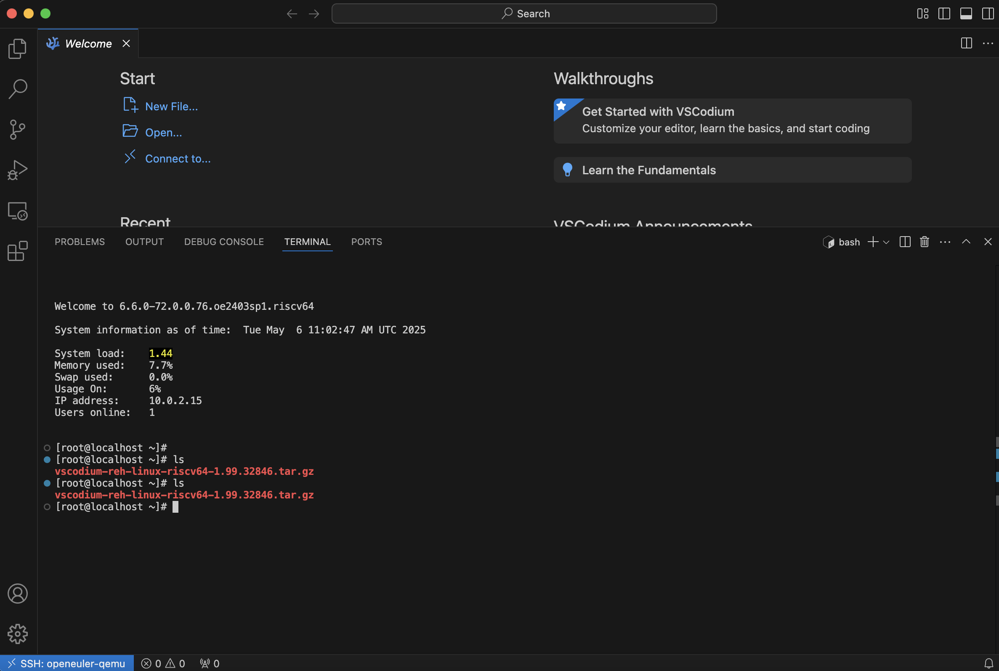

## ARM服务器的连接

没什么技术上的难点，可能就是要配一下ssh跳板机

## OpenEuler-qemu启动

按照[文档](https://docs.openeuler.org/zh/docs/24.03_LTS/docs/Installation/RISC-V-QEMU.html#)下载[必要组件](https://www.openeuler.org/zh/download/#openEuler%2024.03%20LTS%20SP1)，修改memory参数为4G（~~本人在Docker环境下运行，担心内存不足~~） 还是别改。后面编译步骤16g都分分钟干满，最后我分了16G内存16个vcpu

```shell
## Configuration
vcpu=8
memory=4 # 修改了这一行
drive="$(ls *.qcow2)"
fw1="RISCV_VIRT_CODE.fd"
fw2="RISCV_VIRT_VARS.fd"
ssh_port=12055
```

不要忘了解压我们刚刚下载好的`qcow2`镜像文件

```shell
xz -dk openEuler-24.03-LTS-SP1-riscv64.qcow2.xz
```

启动

```shell
chmod +x start_vm.sh
./start_vm.sh
```

### 启动过程中的问题

```text
[    0.000000][    T0] printk: bootconsole [ns16550a0] enabled
[    2.022664][    T1] syscon-poweroff poweroff: pm_power_off already claimed for sbi_srst_power_off
[    4.305469][    T1] integrity: Unable to open file: /etc/keys/x509_ima.der (-2)
[    4.305593][    T1] integrity: Unable to open file: /etc/keys/x509_evm.der (-2)
```

- 这些信息涉及Linux完整性度量架构(IMA)和扩展验证模块(EVM)

- 系统尝试加载安全密钥但没有找到相关文件

- 在普通使用场景下这是正常的，这些功能通常在需要高级安全保障的环境才会配置

这些提示不会影响你的虚拟机正常运行，属于系统启动时的常规信息，尤其是在RISC-V架构的虚拟机上更为常见。只要系统能够正常启动并进入登录界面，你可以忽略这些信息。

### QEMU时间不同步问题

QEMU环境中可能会出现系统时间与实际时间不同步的问题，这会影响许多依赖时间的应用。解决方案是安装NTP服务：

```shell
sudo dnf install chrony -y


```

修改`/etc/chrony/chrony.conf`文件，添加中国服务器

```text
server pool.ntp.org iburst
```

设置ntp服务开机自启动

```shell
sudo systemctl start chronyd
sudo systemctl enable chronyd
```

## RISC-V环境下的远程开发配置

由于VSCode的remote-ssh扩展目前不完全支持RISC-V架构的服务器，我们可以使用开源的VSCodium结合SSH来实现远程开发环境。

### vscodium-remote方式

#### 前置工具安装

首先，在QEMU环境中安装必要的工具：

shell

```shell
dnf install wget tar
```
#### 前置工具安装

```shell
dnf install wget tar
```

> 如果你有代理，可以不用看以下手动安装remote-server的内容了。

第一次直接连vscodium的时候，大概率会直接报错，可以大概terminal的output中切换到remote-ssh中查看报错原因（报错的时候我忘记截图了，所以下面随便给出一张事例，事例中的就是vscodium服务端安装的脚本，我们后续可以利用这个脚本知道启动remote-ssh的时候到底在干嘛）



查看脚本，内容应该如下

```shell
# Server installation script

TMP_DIR="${XDG_RUNTIME_DIR:-"/tmp"}"

DISTRO_VERSION="1.99.3"
DISTRO_COMMIT="0d1cad16ae0ec643ad1fd85b4ba8e52dacf42e85"
DISTRO_QUALITY="stable"
DISTRO_VSCODIUM_RELEASE=""

SERVER_APP_NAME="codium-server"
SERVER_INITIAL_EXTENSIONS=""
SERVER_LISTEN_FLAG="--port=0"
SERVER_DATA_DIR="$HOME/.vscodium-server"
SERVER_DIR="$SERVER_DATA_DIR/bin/$DISTRO_COMMIT"
SERVER_SCRIPT="$SERVER_DIR/bin/$SERVER_APP_NAME"
SERVER_LOGFILE="$SERVER_DATA_DIR/.$DISTRO_COMMIT.log"
SERVER_PIDFILE="$SERVER_DATA_DIR/.$DISTRO_COMMIT.pid"
SERVER_TOKENFILE="$SERVER_DATA_DIR/.$DISTRO_COMMIT.token"
SERVER_ARCH=
SERVER_CONNECTION_TOKEN=
SERVER_DOWNLOAD_URL=

LISTENING_ON=
OS_RELEASE_ID=
ARCH=
PLATFORM=

# Mimic output from logs of remote-ssh extension
print_install_results_and_exit() {
    echo "c4315a1499ee186ae504e504: start"
    echo "exitCode==$1=="
    echo "listeningOn==$LISTENING_ON=="
    echo "connectionToken==$SERVER_CONNECTION_TOKEN=="
    echo "logFile==$SERVER_LOGFILE=="
    echo "osReleaseId==$OS_RELEASE_ID=="
    echo "arch==$ARCH=="
    echo "platform==$PLATFORM=="
    echo "tmpDir==$TMP_DIR=="
    
    echo "c4315a1499ee186ae504e504: end"
    exit 0
}

# Check if platform is supported
KERNEL="$(uname -s)"
case $KERNEL in
    Darwin)
        PLATFORM="darwin"
        ;;
    Linux)
        PLATFORM="linux"
        ;;
    FreeBSD)
        PLATFORM="freebsd"
        ;;
    DragonFly)
        PLATFORM="dragonfly"
        ;;
    *)
        echo "Error platform not supported: $KERNEL"
        print_install_results_and_exit 1
        ;;
esac

# Check machine architecture
ARCH="$(uname -m)"
case $ARCH in
    x86_64 | amd64)
        SERVER_ARCH="x64"
        ;;
    armv7l | armv8l)
        SERVER_ARCH="armhf"
        ;;
    arm64 | aarch64)
        SERVER_ARCH="arm64"
        ;;
    ppc64le)
        SERVER_ARCH="ppc64le"
        ;;
    riscv64)
        SERVER_ARCH="riscv64"
        ;;
    loongarch64)
        SERVER_ARCH="loong64"
        ;;
    s390x)
        SERVER_ARCH="s390x"
        ;;
    *)
        echo "Error architecture not supported: $ARCH"
        print_install_results_and_exit 1
        ;;
esac

# https://www.freedesktop.org/software/systemd/man/os-release.html
OS_RELEASE_ID="$(grep -i '^ID=' /etc/os-release 2>/dev/null | sed 's/^ID=//gi' | sed 's/"//g')"
if [[ -z $OS_RELEASE_ID ]]; then
    OS_RELEASE_ID="$(grep -i '^ID=' /usr/lib/os-release 2>/dev/null | sed 's/^ID=//gi' | sed 's/"//g')"
    if [[ -z $OS_RELEASE_ID ]]; then
        OS_RELEASE_ID="unknown"
    fi
fi

# Create installation folder
if [[ ! -d $SERVER_DIR ]]; then
    mkdir -p $SERVER_DIR
    if (( $? > 0 )); then
        echo "Error creating server install directory"
        print_install_results_and_exit 1
    fi
fi

# adjust platform for vscodium download, if needed
if [[ $OS_RELEASE_ID = alpine ]]; then
    PLATFORM=$OS_RELEASE_ID
fi

SERVER_DOWNLOAD_URL="$(echo "https://github.com/VSCodium/vscodium/releases/download/1.99.32846/vscodium-reh-\${os}-\${arch}-1.99.32846.tar.gz" | sed "s/\${quality}/$DISTRO_QUALITY/g" | sed "s/\${version}/$DISTRO_VERSION/g" | sed "s/\${commit}/$DISTRO_COMMIT/g" | sed "s/\${os}/$PLATFORM/g" | sed "s/\${arch}/$SERVER_ARCH/g" | sed "s/\${release}/$DISTRO_VSCODIUM_RELEASE/g")"

# Check if server script is already installed
if [[ ! -f $SERVER_SCRIPT ]]; then
    case "$PLATFORM" in
        darwin | linux | alpine )
            ;;
        *)
            echo "Error '$PLATFORM' needs manual installation of remote extension host"
            print_install_results_and_exit 1
            ;;
    esac

    pushd $SERVER_DIR > /dev/null

    if [[ ! -z $(which wget) ]]; then
        wget --tries=3 --timeout=10 --continue --no-verbose -O vscode-server.tar.gz $SERVER_DOWNLOAD_URL
    elif [[ ! -z $(which curl) ]]; then
        curl --retry 3 --connect-timeout 10 --location --show-error --silent --output vscode-server.tar.gz $SERVER_DOWNLOAD_URL
    else
        echo "Error no tool to download server binary"
        print_install_results_and_exit 1
    fi

    if (( $? > 0 )); then
        echo "Error downloading server from $SERVER_DOWNLOAD_URL"
        print_install_results_and_exit 1
    fi

    tar -xf vscode-server.tar.gz --strip-components 1
    if (( $? > 0 )); then
        echo "Error while extracting server contents"
        print_install_results_and_exit 1
    fi

    if [[ ! -f $SERVER_SCRIPT ]]; then
        echo "Error server contents are corrupted"
        print_install_results_and_exit 1
    fi

    rm -f vscode-server.tar.gz

    popd > /dev/null
else
    echo "Server script already installed in $SERVER_SCRIPT"
fi

# Try to find if server is already running
if [[ -f $SERVER_PIDFILE ]]; then
    SERVER_PID="$(cat $SERVER_PIDFILE)"
    SERVER_RUNNING_PROCESS="$(ps -o pid,args -p $SERVER_PID | grep $SERVER_SCRIPT)"
else
    SERVER_RUNNING_PROCESS="$(ps -o pid,args -A | grep $SERVER_SCRIPT | grep -v grep)"
fi

if [[ -z $SERVER_RUNNING_PROCESS ]]; then
    if [[ -f $SERVER_LOGFILE ]]; then
        rm $SERVER_LOGFILE
    fi
    if [[ -f $SERVER_TOKENFILE ]]; then
        rm $SERVER_TOKENFILE
    fi

    touch $SERVER_TOKENFILE
    chmod 600 $SERVER_TOKENFILE
    SERVER_CONNECTION_TOKEN="200cf73f-c986-45a4-9f7c-3e3fce5fdc1e"
    echo $SERVER_CONNECTION_TOKEN > $SERVER_TOKENFILE

    $SERVER_SCRIPT --start-server --host=127.0.0.1 $SERVER_LISTEN_FLAG $SERVER_INITIAL_EXTENSIONS --connection-token-file $SERVER_TOKENFILE --telemetry-level off --enable-remote-auto-shutdown --accept-server-license-terms &> $SERVER_LOGFILE &
    echo $! > $SERVER_PIDFILE
else
    echo "Server script is already running $SERVER_SCRIPT"
fi

if [[ -f $SERVER_TOKENFILE ]]; then
    SERVER_CONNECTION_TOKEN="$(cat $SERVER_TOKENFILE)"
else
    echo "Error server token file not found $SERVER_TOKENFILE"
    print_install_results_and_exit 1
fi

if [[ -f $SERVER_LOGFILE ]]; then
    for i in {1..5}; do
        LISTENING_ON="$(cat $SERVER_LOGFILE | grep -E 'Extension host agent listening on .+' | sed 's/Extension host agent listening on //')"
        if [[ -n $LISTENING_ON ]]; then
            break
        fi
        sleep 0.5
    done

    if [[ -z $LISTENING_ON ]]; then
        echo "Error server did not start successfully"
        print_install_results_and_exit 1
    fi
else
    echo "Error server log file not found $SERVER_LOGFILE"
    print_install_results_and_exit 1
fi

# Finish server setup
print_install_results_and_exit 0
```

通常第一次错误是由网络（如果你正确安装了前文提到的前置工具wget的话）引起的（无法下载vscodium的远程服务端）所以我们需要用离线安装的方式安装remote-server。相关vscode中remote-server离线文章很多，下面给出一些参考链接，可以在继续阅读后文之前先熟悉了解一下流程。

https://zhuanlan.zhihu.com/p/699761292

https://zhuanlan.zhihu.com/p/7782586456

vscodium离线安装的方式也是相似的。

我们需要根据下载链接下载对应的服务端，那么我们该如何获取下载链接呢？其实在ssh失败的output中，如果你下载失败了，就会提示出对应的下载链接，当然，也可以阅读（问AI）脚本，获得正确的下载链接。

阅读脚本可知，我们需要的链接形如

```text
https://github.com/VSCodium/vscodium/releases/download/1.99.32846/vscodium-reh-${os}-${arch}-1.99.32846.tar.gz
```

其中\${os},${arch}是我们需要修改的系统和平台。因为我们是基于RISCV的OpenEuler操作系统，所以分别填入`linux`和`risc64`应该就能获取到我们想要的链接。

然后利用scp命令，将软件包复制到qemu中，并解压到正确的目录。

以下是我进行的操作（你可以直接把报错里面出现的脚本丢给ai，问他怎么做），**注意，因为vscodium版本是变化的，所以我们的文件路径都有可能不同，不能照抄！**，首先在qemu的宿主机中，这里12055是qemu默认的ssh端口

```shell

scp -P 12055 ./vscodium-reh-linux-riscv64-1.99.32846.tar.gz root@localhost:/root
```

然后在qemu中

```shell
# 创建目标目录
mkdir -p ~/.vscodium-server/bin/0d1cad16ae0ec643ad1fd85b4ba8e52dacf42e85

# 复制你的预下载包到这个目录，这个目录是动态根据commit变更的
cp ./vscodium-reh-linux-arm64-1.99.32846.tar.gz ~/.vscodium-server/bin/0d1cad16ae0ec643ad1fd85b4ba8e52dacf42e85/vscode-server.tar.gz

# 进入目录
cd ~/.vscodium-server/bin/0d1cad16ae0ec643ad1fd85b4ba8e52dacf42e85

# 解压文件
tar -xf vscode-server.tar.gz --strip-components 1

# 可选：删除压缩包
rm vscode-server.tar.gz
```

进行完这一步操作之后，如果我们通过vscodium链接qemu，可能还是会连不上，出现循环输入密码的情况，推测是TCP转发出了问题，所以我们需要做相应更改。

#### SSH中TCP隧道转发配置

即使完成了上述步骤，仍可能出现连接失败或循环输入密码的情况。这通常是因为SSH的TCP转发功能未启用。需要修改SSH配置：

```shell
# 编辑SSH配置文件
vi /etc/ssh/sshd_config

# 确保以下配置项被启用（去掉前面的注释符号）
AllowTcpForwarding yes

# 重启SSH服务
systemctl restart sshd
```

完成以上所有步骤后，就可以通过VSCodium成功连接到RISC-V架构的QEMU环境了，后续各组件兼容性暂未测试。本文只是提出一种工作环境的可能，可能后续还是会使用挂载宿主机文件夹的方式进行开发。



### 挂载开发方式

鸽了
