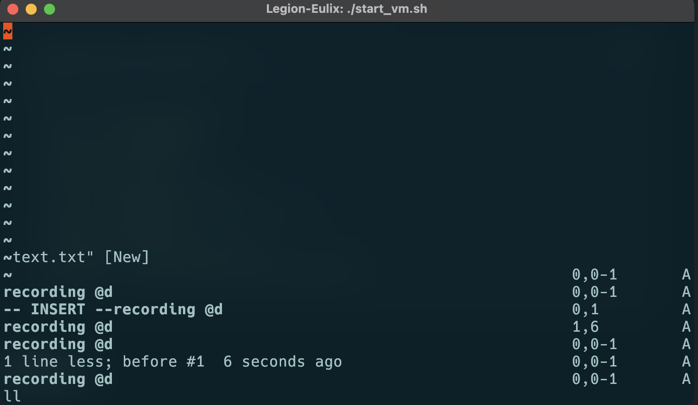
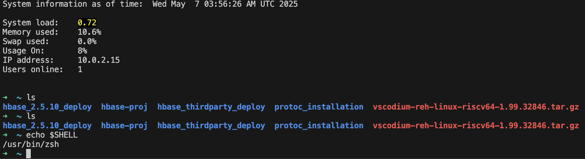
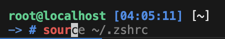

## 配置代理

简述一下我的环境，我的qemu运行在WSL中的Docker中，Docker Container层的代理是WSL（我才用了mirroeed网络模式，所以实际上WSL用的也是宿主机的端口，详情可见我的[博客](https://delusion.uno/posts/Mirroed-WSL-Docker-Proxy/)），所以我本来以为是要在qemu中连接到qemu上层，也就是Docker Container访问代理，结果经过尝试，发现qemu中可以直接ping到我宿主机/WSL的ip，也就是我路由器分配给宿主机/WSL的ip（192.168.x.x）。所以索性直接把Docker Container中的代理文件复制进qemu的`~/.bashrc`中了，结果还真能成果，我的代理部分如下。

```shell
proxy_ip="192.168.6.115"
proxy_port="7890"

alias proxy="
    export http_proxy=http://$proxy_ip:$proxy_port;
    export https_proxy=http://$proxy_ip:$proxy_port;
    export all_proxy=http://$proxy_ip:$proxy_port;
    export HTTP_PROXY=http://$proxy_ip:$proxy_port;
    export HTTPS_PROXY=http://$proxy_ip:$proxy_port;
    export ALL_PROXY=http://$proxy_ip:$proxy_port;"
alias unproxy="
    unset http_proxy;
    unset https_proxy;
    unset all_proxy;
    unset HTTP_PROXY;
    unset HTTPS_PROXY;
    unset ALL_PROXY;"
proxy
```

接下来可以输入`curl ipinfo.io`来验证代理网络，返回结果

```shell
root@localhost [04:10:53] [~] 
-> # curl ipinfo.io
{
  "ip": "185.244.208.192",
  "city": "Hong Kong",
  "region": "Hong Kong",
  "country": "HK",
  "loc": "22.2783,114.1747",
  "org": "AS199524 G-Core Labs S.A.",
  "postal": "999077",
  "timezone": "Asia/Hong_Kong",
  "readme": "https://ipinfo.io/missingauth"
}#   
```

## 配置zsh

因为我使用的是kitty中的kitten ssh，在bash下会出现很多奇怪的情况，体现在一些操作字符的持久保留，比如在vim下，会出现如下图所示的情况，当然这个情况可以通过使用普通的ssh避免。



所以选择安装了zsh。不是必要的配置，不过即使没有奇怪的bug，我也推荐大家使用zsh，不仅美观可以显示很多信息，而且还有很多好用的插件。


### 安装zsh

```shell
dnf install zsh
```

### 切换默认shell

其实可以不用管，后面ohmyzsh安装的时候会自动设置，但是我做这一步的时候遇到了一些奇怪的情况，所以记录一下。

```shell
# 安装包含chsh命令的包
sudo dnf install util-linux-user

chsh -s $(which zsh)
```

重启shell应该会进入到zsh，但这里会出现一个奇怪的情况

```shell
[root@localhost]~# # 233
zsh: command not found: #
[root@localhost]~# echo $SHELL
/bin/bash
```

目前仍在使用bash作为默认shell，而不是zsh。这可以从`echo $SHELL`命令的输出`/bin/bash`清楚地看出。

但从第一行命令`# 233`后收到的错误信息`zsh: command not found: #`来看，当前命令解释器似乎是zsh。这是一种有趣的情况

要确认当前正在使用的shell，可以运行:

```bash
ps -p $$
```

这将显示当前shell进程的名称。结果没问题，是zsh

### 安装ohmyzsh

gitee源omz

```shell
sh -c "$(curl -fsSL https://gitee.com/mirrors/oh-my-zsh/raw/master/tools/install.sh)"
```

运行过程中会提示你要不要更改当前的默认终端，我们输入y

运行结束之后，可以看到zsh和ohmyzsh都工作的很好。



### 安装ohmyzsh插件以及主题

拉下来插件仓库，注意这一步要在代理下完成。

```shell
git clone https://github.com/zsh-users/zsh-syntax-highlighting.git ${ZSH_CUSTOM:-~/.oh-my-zsh/custom}/plugins/zsh-syntax-highlighting
git clone https://github.com/zsh-users/zsh-autosuggestions ${ZSH_CUSTOM:-~/.oh-my-zsh/custom}/plugins/zsh-autosuggestions
```

修改配置文件

```shell
vi ~/.zshrc
```

```text
plugins=(git dnf z web-search zsh-syntax-highlighting zsh-autosuggestions)

ZSH_THEME="crcandy"
```

修改完成之后，我们好用的zsh就配置完成了！记得把原先`~/.bashrc`的代理配置复制进`~/.zshrc`


## qemu内部署Hbase

### 复制脚本

将部署脚本复制进qemu中运行，注意运行过程中需要代理。

```shell
Error parsing proxy URL socks5://192.168.6.115:7890: Unsupported scheme.
```

### 运行脚本时报错内存不足

表现现象为，编译中的终端出现
```shell
c++: fatal error: Killed signal terminated program cc1plus
compilation terminated.
make[2]: *** [third_party/abseil-cpp/absl/flags/CMakeFiles/flags_usage_internal.dir/build.make:76: third_party/abseil-cpp/absl/flags/CMakeFiles/flags_usage_internal.dir/internal/usage.cc.o] Error 1
make[1]: *** [CMakeFiles/Makefile2:2849: third_party/abseil-cpp/absl/flags/CMakeFiles/flags_usage_internal.dir/all] Error 2
make[1]: *** Waiting for unfinished jobs....
[ 61%] Building CXX object CMakeFiles/libprotobuf-lite.dir/src/google/protobuf/io/coded_stream.cc.o
c++: fatal error: Killed signal terminated program cc1plus
compilation terminated.
make[2]: *** [CMakeFiles/libprotobuf.dir/build.make:356: CMakeFiles/libprotobuf.dir/src/google/protobuf/descriptor.pb.cc.o] Error 1
make[2]: *** Waiting for unfinished jobs....
[ 61%] Building CXX object CMakeFiles/libprotobuf-lite.dir/src/google/protobuf/io/zero_copy_stream.cc.o
c++: fatal error: Killed signal terminated program cc1plus
```

其他终端出现
```shell
root@localhost [21:58:57] [~] 
-> # [ 1364.294650][T17314] Out of memory: Killed process 17151 (cc1plus) total-vm:244616kB, anon-rss:194012kB, file-rss:5072kB, shmem-rss:0kB, UID:0 pgtables:472kB oom_score_adj:0
[ 1393.317504][T18497] Out of memory: Killed process 17332 (cc1plus) total-vm:259756kB, anon-rss:200312kB, file-rss:1460kB, shmem-rss:0kB, UID:0 pgtables:492kB oom_score_adj:0
[ 1417.950128][T18591] Out of memory: Killed process 17329 (cc1plus) total-vm:262140kB, anon-rss:202724kB, file-rss:2424kB, shmem-rss:0kB, UID:0 pgtables:492kB oom_score_adj:0
[ 1452.754503][T17330] Out of memory: Killed process 17324 (cc1plus) total-vm:243340kB, anon-rss:198084kB, file-rss:1564kB, shmem-rss:0kB, UID:0 pgtables:476kB oom_score_adj:0
```


## arm服务器部署HBase

### build报错

```shell
在arm平台执行hbase从src部署时候 mvn install的时候出现

[INFO] Apache HBase - Archetypes .......................... SKIPPED
[INFO] Apache HBase - Exemplar for hbase-client archetype . SKIPPED
[INFO] Apache HBase - Exemplar for hbase-shaded-client archetype SKIPPED
[INFO] Apache HBase - Archetype builder ................... SKIPPED
[INFO] ------------------------------------------------------------------------
[INFO] BUILD FAILURE
[INFO] ------------------------------------------------------------------------
[INFO] Total time:  27:04 min
[INFO] Finished at: 2025-05-07T20:07:30+08:00
[INFO] ------------------------------------------------------------------------
[ERROR] Failed to execute goal org.apache.maven.plugins:maven-surefire-plugin:3.1.0:test (secondPartTestsExecution) on project hbase-server: There are test failures.
[ERROR] 
[ERROR] Please refer to /home/wangchenyu/HBase/hbase-2.5.11/hbase-server/target/surefire-reports for the individual test results.
[ERROR] Please refer to dump files (if any exist) [date].dump, [date]-jvmRun[N].dump and [date].dumpstream.
[ERROR] -> [Help 1]
[ERROR] 
[ERROR] To see the full stack trace of the errors, re-run Maven with the -e switch.
[ERROR] Re-run Maven using the -X switch to enable full debug logging.
[ERROR] 
[ERROR] For more information about the errors and possible solutions, please read the following articles:
[ERROR] [Help 1] http://cwiki.apache.org/confluence/display/MAVEN/MojoFailureException
[ERROR] 
[ERROR] After correcting the problems, you can resume the build with the command
[ERROR]   mvn <args> -rf :hbase-server
```

解决办法

```shell
	mvn install -DskipTests -rf :hbase-server
```

从失败的模块继续构建，执行过后可以构建成功。
### SLF4J多绑定警告

```text
SLF4J: Class path contains multiple SLF4J bindings.
SLF4J: Found binding in [jar:file:/usr/local/hadoop-3.4.0/share/hadoop/common/lib/slf4j-reload4j-1.7.36.jar!/org/slf4j/impl/StaticLoggerBinder.class]
SLF4J: Found binding in [jar:file:/home/wangchenyu/.m2/repository/org/apache/logging/log4j/log4j-slf4j-impl/2.17.2/log4j-slf4j-impl-2.17.2.jar!/org/slf4j/impl/StaticLoggerBinder.class]
SLF4J: See http://www.slf4j.org/codes.html#multiple_bindings for an explanation.
SLF4J: Actual binding is of type [org.slf4j.impl.Reload4jLoggerFactory]
running master, logging to /home/wangchenyu/HBase/hbase-2.5.11/bin/../logs/hbase-wangchenyu-master-localhost.out
SLF4J: Class path contains multiple SLF4J bindings.
SLF4J: Found binding in [jar:file:/usr/local/hadoop-3.4.0/share/hadoop/common/lib/slf4j-reload4j-1.7.36.jar!/org/slf4j/impl/StaticLoggerBinder.class]
SLF4J: Found binding in [jar:file:/home/wangchenyu/.m2/repository/org/apache/logging/log4j/log4j-slf4j-impl/2.17.2/log4j-slf4j-impl-2.17.2.jar!/org/slf4j/impl/StaticLoggerBinder.class]
SLF4J: See http://www.slf4j.org/codes.html#multiple_bindings for an explanation.
```

不管，不是关键

### zookeeper间断式休眠

在运行`./bin/start-hbase.sh`启动之后，运行`./bin/hbase shell`之后zookeeper时不时断联，但是连续按下回车之后，shell确实是有反应的，推测是zookeeper运行后被强制下线，但是又不断重连，经过短暂时间之后又会下线。

```shell
2025-05-08 00:32:31,348 INFO zookeeper.ClientCnxn: SASL config status: Will not attempt to authenticate using SASL (unknown error)
2025-05-08 00:32:31,348 WARN zookeeper.ClientCnxn: Session 0x0 for server localhost/127.0.0.1:2181, Closing socket connection. Attempting reconnect except it is a SessionExpiredException.
java.net.ConnectException: Connection refused
	at java.base/sun.nio.ch.SocketChannelImpl.checkConnect(Native Method)
	at java.base/sun.nio.ch.SocketChannelImpl.finishConnect(SocketChannelImpl.java:777)
	at org.apache.zookeeper.ClientCnxnSocketNIO.doTransport(ClientCnxnSocketNIO.java:344)
	at org.apache.zookeeper.ClientCnxn$SendThread.run(ClientCnxn.java:1289)
2025-05-08 00:32:32,449 INFO zookeeper.ClientCnxn: Opening socket connection to server localhost/127.0.0.1:2181.
2025-05-08 00:32:32,449 INFO zookeeper.ClientCnxn: SASL config status: Will not attempt to authenticate using SASL (unknown error)
2025-05-08 00:32:32,449 WARN zookeeper.ClientCnxn: Session 0x0 for server localhost/127.0.0.1:2181, Closing socket connection. Attempting reconnect except it is a SessionExpiredException.
java.net.ConnectException: Connection refused
	at java.base/sun.nio.ch.SocketChannelImpl.checkConnect(Native Method)
	at java.base/sun.nio.ch.SocketChannelImpl.finishConnect(SocketChannelImpl.java:777)
	at org.apache.zookeeper.ClientCnxnSocketNIO.doTransport(ClientCnxnSocketNIO.java:344)
	at org.apache.zookeeper.ClientCnxn$SendThread.run(ClientCnxn.java:1289)
2025-05-08 00:32:33,550 INFO zookeeper.ClientCnxn: Opening socket connection to server localhost/127.0.0.1:2181.
2025-05-08 00:32:33,550 INFO zookeeper.ClientCnxn: SASL config status: Will not attempt to authenticate using SASL (unknown error)
2025-05-08 00:32:33,551 WARN zookeeper.ClientCnxn: Session 0x0 for server localhost/127.0.0.1:2181, Closing socket connection. Attempting reconnect except it is a SessionExpiredException.
java.net.ConnectException: Connection refused
	at java.base/sun.nio.ch.SocketChannelImpl.checkConnect(Native Method)
	at java.base/sun.nio.ch.SocketChannelImpl.finishConnect(SocketChannelImpl.java:777)
	at org.apache.zookeeper.ClientCnxnSocketNIO.doTransport(ClientCnxnSocketNIO.java:344)
	at org.apache.zookeeper.ClientCnxn$SendThread.run(ClientCnxn.java:1289)

hbase:002:0> 
hbase:003:0> 2025-05-08 00:32:34,651 INFO zookeeper.ClientCnxn: Opening socket connection to server localhost/127.0.0.1:2181.
2025-05-08 00:32:34,651 INFO zookeeper.ClientCnxn: SASL config status: Will not attempt to authenticate using SASL (unknown error)
2025-05-08 00:32:34,652 WARN zookeeper.ClientCnxn: Session 0x0 for server localhost/127.0.0.1:2181, Closing socket connection. Attempting reconnect except it is a SessionExpiredException.
java.net.ConnectException: Connection refused
	at java.base/sun.nio.ch.SocketChannelImpl.checkConnect(Native Method)
	at java.base/sun.nio.ch.SocketChannelImpl.finishConnect(SocketChannelImpl.java:777)
	at org.apache.zookeeper.ClientCnxnSocketNIO.doTransport(ClientCnxnSocketNIO.java:344)
	at org.apache.zookeeper.ClientCnxn$SendThread.run(ClientCnxn.java:1289)

hbase:004:0> 
hbase:005:0> 
hbase:006:0> 
hbase:007:0> 
hbase:008:0> 
hbase:009:0> 2025-05-08 00:32:35,753 INFO zookeeper.ClientCnxn: Opening socket connection to server localhost/127.0.0.1:2181.
2025-05-08 00:32:35,753 INFO zookeeper.ClientCnxn: SASL config status: Will not attempt to authenticate using SASL (unknown error)
2025-05-08 00:32:35,753 WARN zookeeper.ClientCnxn: Session 0x0 for server localhost/127.0.0.1:2181, Closing socket connection. Attempting reconnect except it is a SessionExpiredException.
java.net.ConnectException: Connection refused
	at java.base/sun.nio.ch.SocketChannelImpl.checkConnect(Native Method)
	at java.base/sun.nio.ch.SocketChannelImpl.finishConnect(SocketChannelImpl.java:777)
	at org.apache.zookeeper.ClientCnxnSocketNIO.doTransport(ClientCnxnSocketNIO.java:344)
	at org.apache.zookeeper.ClientCnxn$SendThread.run(ClientCnxn.java:1289)

hbase:010:0> 
```

注意在我连续按回车的时候，shell短暂的显示了出来，实际上短暂的进入到了shell中，但是感觉zookeeper一直被什么东西杀死，然后又重启，在这个间隙中，我可以短暂的进入shell。

#### 尝试解决方案1

手动启动zookeeper

```shell
bin/hbase-daemon.sh start zookeeper
```

再次尝试连接，即可连接上

```
./bin/hbase shell
```

但是出现新问题

```shell
hbase:001:0> list
TABLE                                                                      

ERROR: KeeperErrorCode = NoNode for /hbase/master

For usage try 'help "list"'

Took 0.1152 seconds            
```

找到原因，这是分布式部署时需要的步骤，单机部署应该不需要显示的手动启动zookeeper。所以实际上问题未能解决。

#### 尝试解决方案2

更换jdk版本。

由jdk17更换为jdk11，未能解决。

#### 尝试解决方案3

指定网络环境

修改hbase目录下的`conf/hbase-site.xml`，指定了zookeeper的运行参数

```xml
<property>
    <name>hbase.zookeeper.quorum</name>
    <value>127.0.0.1</value>
  </property>
  <property>
    <name>hbase.zookeeper.property.clientPort</name>
    <value>2181</value>
    <description>ZooKeeper客户端连接端口</description>
  </property>
```

未能解决问题。

#### 尝试解决方案3

修改`conf/hbase-site.xml`配置，指定了hbase存放数据目录，成功运行。

```xml
<property>
    <name>hbase.cluster.distributed</name>
    <value>false</value>
  </property>
  <property>
    <name>hbase.tmp.dir</name>
    <value>/home/wangchenyu/HBase/hbase-data/tmp</value>
  </property>
  <property>
    <name>hbase.rootdir</name>
    <value>file:///home/wangchenyu/HBase/hbase-data/hbase</value>
  </property>
  <property>
    <name>hbase.unsafe.stream.capability.enforce</name>
    <value>false</value>
  </property>
</configuration>
```

其中hbase.rootdir属性必须指定

>在单机模式下，如果不明确指定使用本地文件系统（通过`file://`前缀），HBase默认会尝试使用HDFS作为存储系统，这会导致连接错误，因为单机模式通常没有配置HDFS

---

单机部署阶段参考文章

https://www.cnblogs.com/h--d/p/11580398.html

https://www.cnblogs.com/xxxchik/p/16417292.html

https://blog.51cto.com/u_16099192/8703059