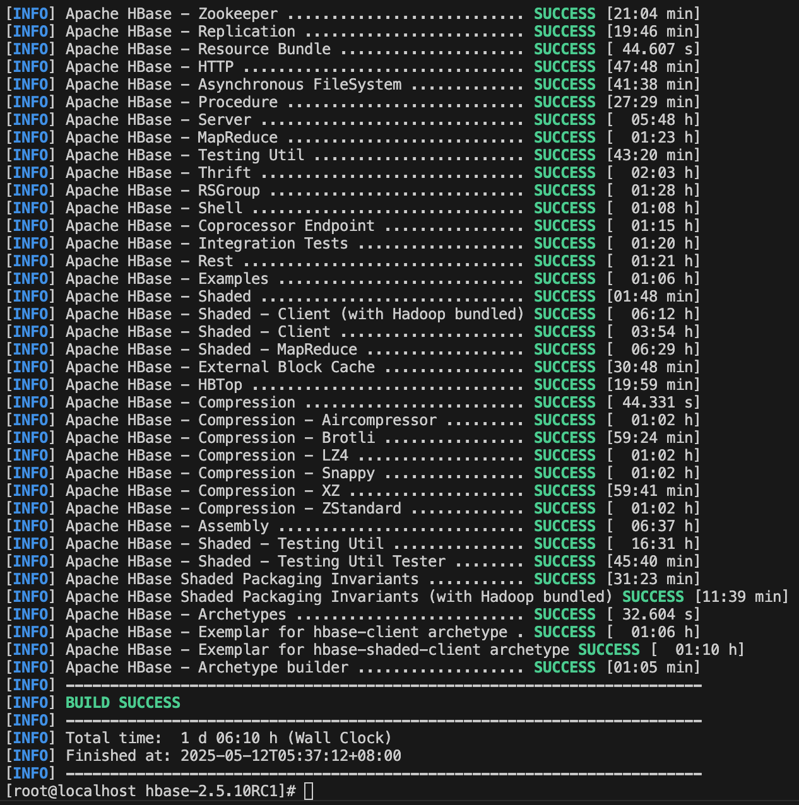

build了一天，结果还是失败了，问题出在网络上，所以直接把Maven仓库设置阿里云镜像。

经过了30个小时的漫长编译，HBase终于编译成功



### Jruby问题

部署之后，无法通过/bin/hbase shell连接到hbase shell，所以通过REST API访问HBase

```shell
# 启动REST服务器
./bin/hbase rest start -p 8080

# 使用curl获取表信息
curl -H "Accept: application/json" http://localhost:8080/

# 创建名为"users"的表，有一个列族"info"
curl -H "Content-Type: application/json" -X PUT \
  -d '{"ColumnSchema":[{"name":"info"}]}' \
  http://localhost:8080/users/schema

curl -H "Accept: application/json" http://localhost:8080/users/schema
```

可知HBase正确启动。

```shell
[root@localhost ~]# curl -H "Content-Type: application/json" -X PUT \
  -d '{"ColumnSchema":[{"name":"info"}]}' \
  http://localhost:8080/users/schema

[root@localhost ~]# curl -H "Accept: application/json" http://localhost:8080/users/schema
{"name":"users","ColumnSchema":[{"name":"info","INDEX_BLOCK_ENCODING":"NONE","VERSIONS":"1","KEEP_DELETED_CELLS":"FALSE","DATA_BLOCK_ENCODING":"NONE","TTL":"2147483647","MIN_VERSIONS":"0","REPLICATION_SCOPE":"0","BLOOMFILTER":"ROW","IN_MEMORY":"false","COMPRESSION":"NONE","BLOCKCACHE":"true","BLOCKSIZE":"65536"}],"IS_META":"false"}
```