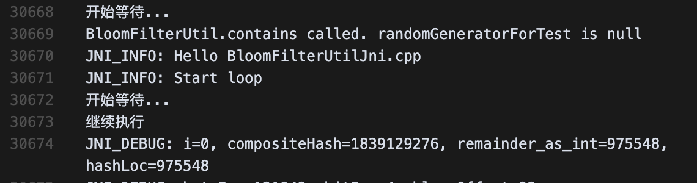
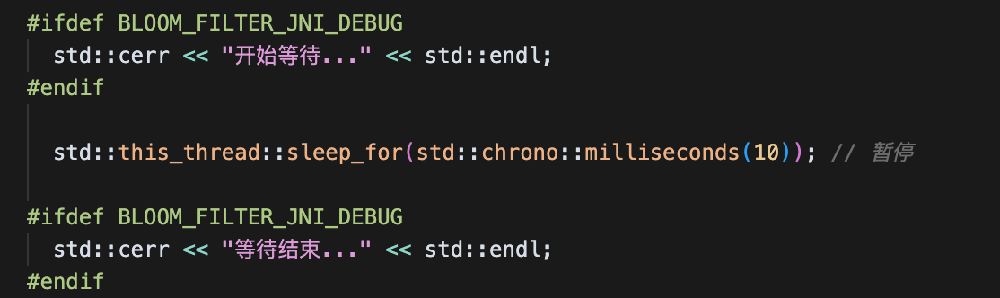
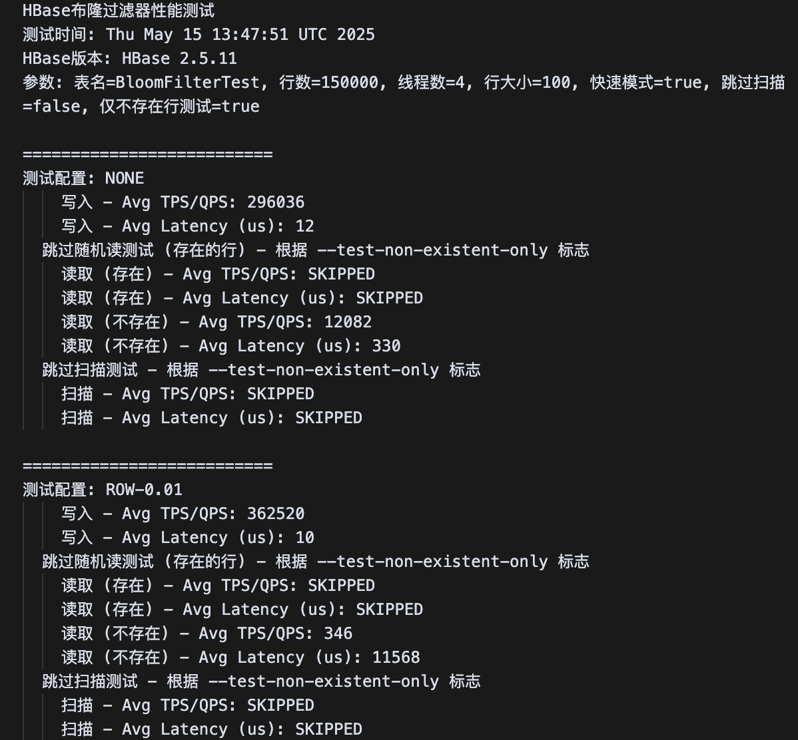

进行HBase是否采用JNI动态链接库版本的布隆过滤器进行探究。

### 验证1--LOG验证

采用两组测试数据，一组数据在开启了布隆过滤器的表中进行，一组在没有开启布隆过滤器的表中进行。

查看了$HBASE_HOME/logs/hbase-root-master-Legion-Eulix.out中的数据，发现，在未开启布隆过滤器的表测试的时候，log信息并没有出现。当开启布隆过滤器的表开始测试的时候，我们手动在JNI层的CPP文件中设置的DEBUG信息一下子出现了。并且短短时间就出现了很多次。

>在实验中发现，如果表中已经存在很多数据，即使只是启动测试脚本，布隆过滤器也会被访问几次，推断是在脚本开始进行布隆测试表删除的时候会调用？

设计验证实验--手动在JNI实现的cpp文件中添加延迟操作，这样的话JNI版本的HBase在开启布隆过滤器进行操作之后，速度应该会大幅度下降。

但是在实验过程中注意到，如果手动设置的延迟太大，可能会造成其他组件timeout的现象，所以这个延迟需要把控好，根据本人测试，设置到800ms观测到的现象比较明显（代价是跑测试很耗时）。

另外在测试的过程中根据LOG得出一个**猜想**，即使在开启了布隆过滤器的表中进行读操作，若读取的行数过于小，布隆过滤器可能不会开启，得出此猜想的依据是：

在参数为`参数: 表名=BloomFilterTest, 行数=300000, 线程数=4, 行大小=100, 快速模式=true, 跳过扫描=false, 仅不存在行测试=true`的时候，虽然未设置布隆过滤器的表在读写或者删表的时候，会偶尔的调用几次布隆过滤器，但是在执行布隆过滤器表的读操作时候，频繁的访问了非常多次布隆过滤器。

在参数为`参数: 表名=BloomFilterTest, 行数=5000, 线程数=4, 行大小=100, 快速模式=true, 跳过扫描=false, 仅不存在行测试=true`的时候，在执行布隆过滤器表的读操作时候，好像并未出现频繁访问的情况，不过也可能是测试数据过小，所以我们稍微改大测试参数再次尝试。

在参数为`参数: 表名=BloomFilterTest, 行数=100000, 线程数=4, 行大小=100, 快速模式=true, 跳过扫描=false, 仅不存在行测试=true`的时候，在执行布隆过滤器表的读操作时候，也未出现频繁访问的情况

所以可得出结论，表数据太小的时候，布隆过滤器并不会出现显著作用。

### SLEEP语句验证

在JNI层的CPP文件中调用sleep语句，让布隆过滤器表性能更慢，检查HBase在执行相关测试时是否受到影响判断是否采用了JNI版本。

实际测试中，未开启布隆过滤器的表在行数=300000, 线程数=4, 行大小=100的测试条件下，只需要2分钟即可完成随机读不存在表的测试，而开启了布隆过滤器的表则运行了1个多小时都未完成（200ms延迟情况下），并且查看日志，发现日志行数已经超过400万行。并且开启布隆过滤器的表的读操作并未受到影响。可以得到确实采用了JNI版本的HBase。

在修改测试数据并将延迟手动将为10ms以后，测试总算能在可控时间内跑完了，可以看出布隆表读性能非常低，可知HBase在采用我们编辑过的布隆过滤器。

